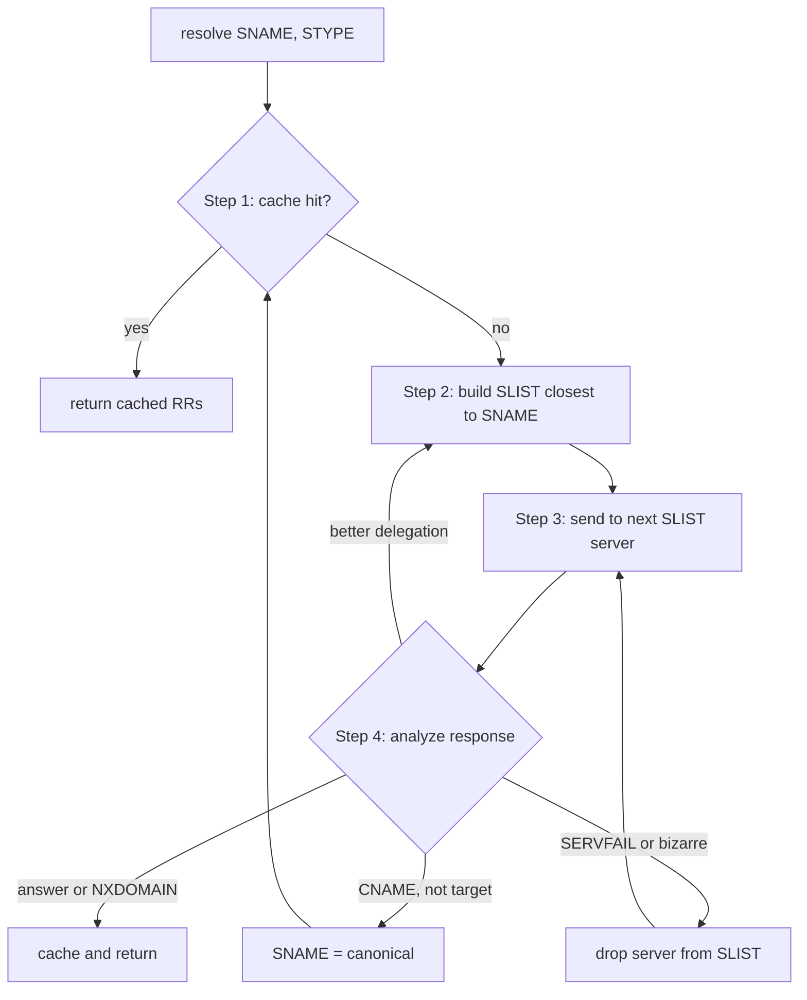
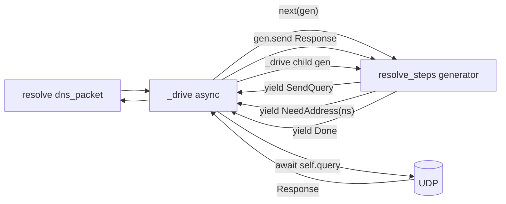
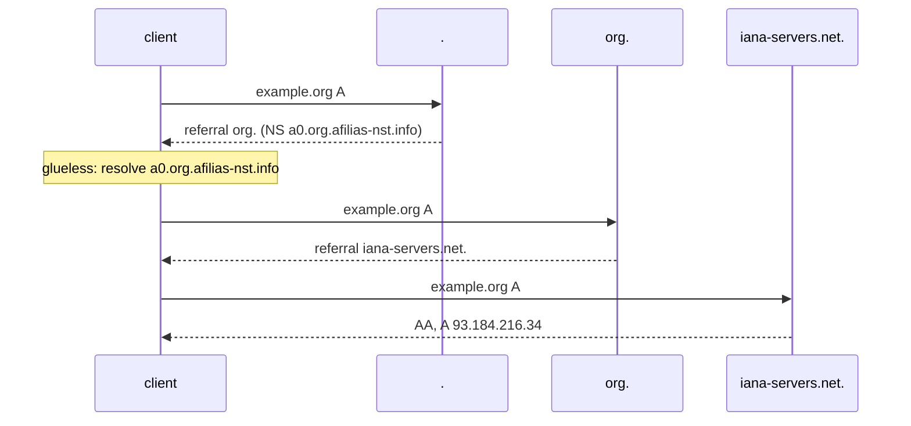

## 1. Reference doc: `resolution.MD`

New file at repo root that summarizes RFC 1034's recursive-resolution model and maps each concept onto [aiodns/resolver.py](aiodns/resolver.py). It is written to be re-read whenever we touch the resolver, so it doubles as a contributor guide.

Structure:

- **Recursive vs iterative service** (RFC 1034 §4.3.1) — RD / RA semantics; what our `RecursiveResolver` accepts vs. what it sends upstream (we send `RD=False` to authoritative servers).
- **Resolver state** (§5.3.2): SNAME, STYPE, SCLASS, SLIST, SBELT, CACHE — what each holds; for us SBELT is `self.root_hints`, CACHE is currently absent (TODO marker), SLIST is the variable we are introducing.
- **The four-step algorithm** (§5.3.3) with this Mermaid flowchart:



- **Match count and "closer" delegations** (§5.3.3 step 4b): how to tell a referral is progress vs. a loop.
- **Glueless NS** (§5.3.3 step 2 priorities): when to start a *parallel* sub-resolution for an NS A/AAAA and when to give up.
- **Negative responses** (§4.3.4): NODATA carries the SOA in *authority*; NXDOMAIN ditto. Why we must not synthesize an extra SOA query.
- **CNAME chasing** (§5.3.3 step 4c): rename SNAME and restart (capped depth).
- **Server-side reply shape** (§4.3.2 steps a/b/c): how an authoritative server emits an answer vs. a referral; lets us interpret AA, ANCOUNT, NSCOUNT correctly on the client side.
- **Code mapping table**: each spec concept → file/symbol. E.g. SBELT → `RecursiveResolver.root_hints` (`bootstrap`); §5.3.3 step 2 → `_nameserver_address_pairs`; step 3 → `Resolver.query`; step 4 analysis → the if-tree in `_iterative_query`.

## 2. Resolver refactor: generator of next-steps + SLIST/SBELT/SNAME

### Architecture



The resolver becomes pure logic that yields effect objects describing what to do next; the async driver fulfills them. Trace = the yield stream (plus nested child streams for sub-resolves). Tests can drive the generator synchronously with `gen.send(canned_response)` — no sockets.

### New state objects in [aiodns/resolver.py](aiodns/resolver.py) (no type hints, dunder-driven):

- `class Sname` — wraps the question name; carries `STYPE`, `SCLASS`. Knows `match_count(zone_dname)` returning the labels-shared-with-root count for §5.3.3 "closer" checks.
- `class SlistEntry` — one (zone-cut name, ns `DomainName`, addresses list, history) row. `__repr__` for trace.
- `class Slist` — ordered collection with `best()`, `demote(entry)`, `extend_from_referral(response, sname)` (rejects referrals whose match count is not strictly greater than the current — §5.3.3 step 4b), `merge_glue(entry, addresses)`.
- `Sbelt(Slist)` is just an `Slist` constructed once from `self.root_hints`; `copy_for(sname)` returns a fresh SLIST seeded from SBELT.

### Effect/step objects (also serve as trace events)

Tiny classes with `__repr__`. The resolver yields one of these each time it needs the driver to do something or just wants to record a decision:

- `SendQuery(entry, questions)` — driver `await self.query(...)`, sends back a `Response`.
- `NeedAddress(ns_name)` — driver runs a nested `resolve_steps` for `ns_name A`, sends back the address list.
- `Referral(old_zone, new_zone, match_before, match_after)` — pure trace.
- `Answer(records)` / `Nodata(soa)` / `Nxdomain()` / `Cname(target)` / `Demote(entry, reason)` / `Fail(reason)` — pure trace.
- `Done(response)` — terminal; driver stops iterating.

### `resolve_steps(sname, slist)` — sync generator

```python
def resolve_steps(sname, slist):
    for _ in range(MAX_HOPS):
        entry = slist.best()
        if entry is None:
            yield Fail("no servers"); return
        if not entry.addresses:
            addrs = yield NeedAddress(entry.ns)
            slist.merge_glue(entry, addrs)
            continue
        response = yield SendQuery(entry, sname.questions)
        for step in classify(response, sname, slist):
            yield step
            if isinstance(step, Done): return
            if isinstance(step, Demote): slist.demote(entry)
```

`classify(response, sname, slist)` is a small sync helper that reads `RCODE`, `AA`, `ANCOUNT`, `NSCOUNT`, applies §5.3.3 step 4 (a/b/c/d), and yields the right sequence of trace events ending in either `Done(response)` (a/b terminal), `Referral(...)` (b — better delegation, also extends `slist`), `Cname(target)` (c — placeholder for now, see Risks), or `Demote(entry, reason)` (d).

### Async driver `RecursiveResolver._drive(gen, trace, depth)`

```python
async def _drive(self, gen, trace, depth=0):
    if depth > MAX_DEPTH: return None
    sent = None
    while True:
        try:
            step = gen.send(sent)
        except StopIteration:
            return None
        trace.record(step)
        if isinstance(step, SendQuery):
            sent = await self._send(step.entry, step.questions)
        elif isinstance(step, NeedAddress):
            child = trace.child(step.ns_name)
            sub = resolve_steps(Sname(step.ns_name, DnsQType.A), self.sbelt.copy_for(...))
            sent = await self._drive(sub, child, depth + 1) or []
        elif isinstance(step, Done):
            return step.response
        else:
            sent = None
```

### `RecursiveResolver.resolve(dns_packet)`

```python
async def resolve(self, dns_packet):
    sname = Sname.from_question(dns_packet.questions[0])
    self.last_trace = Trace(sname)
    gen = resolve_steps(sname, self.sbelt.copy_for(sname))
    response = await self._drive(gen, self.last_trace)
    if isinstance(response, Response):
        response.ID = dns_packet.ID
        response.trace = self.last_trace
    return response
```

### Behavior preserved / fixed
- Still sends `RD=False` upstream.
- Still rewrites response `ID` to match the client query.
- §5.3.3 step 4b match-count check is now real (rejects sideways/lame referrals); the previous code accepted any `NSCOUNT > 0` as a referral.
- Hop/depth caps as module constants `MAX_HOPS = 32`, `MAX_DEPTH = 24`.

## 3. Trace + Mermaid renderer

### New file [aiodns/trace.py](aiodns/trace.py)

- `class Trace` — keyed on the originating `Sname`. Holds:
  - `events` — the recorded yield stream (the same effect objects from §2), in order.
  - `children` — list of nested `Trace`s, one per `NeedAddress` glueless sub-resolution.
- One small method: `record(step)` — appends to `events`; if the step is `NeedAddress`, returns/creates a child `Trace` that the driver passes to the sub-`_drive`.
- `Trace.to_mermaid()` walks `events` once and emits a Mermaid `sequenceDiagram`. Lanes:
  - one `client` lane,
  - one lane per *zone cut* visited (e.g., `.`, `com.`, `iana-servers.net.`),
  - inline `Note over` for `Nodata` (with SOA), `Nxdomain`, `Demote`, `Fail`,
  - glueless sub-resolutions render as a `Note over client` "glueless: <ns>" plus the child trace appended as a separate `sequenceDiagram` block under the main one (since `sequenceDiagram` doesn't truly nest).

Sample shape of emitted diagram:



### Wiring

- `RecursiveResolver.resolve(dns_packet)` constructs a `Trace`, threads it through `_iterative_query`, attaches `trace` to the result (`response.trace = trace`), and stores `self.last_trace = trace` for inspection.
- [aiodns/__main__.py](aiodns/__main__.py): after `_lookup_example_org_via_local_server`, write `resolver_protocol.last_trace.to_mermaid()` to `last_resolution.md` next to the cwd, so devs can open it and see the run.

## 4. Tests

All offline — driving the generator synchronously is the whole point of this design:

- `tests/test_resolve_steps.py` — build an SLIST seeded from a fake SBELT, call `gen = resolve_steps(sname, slist)`, then alternate `next(gen)` / `gen.send(canned_Response)` to walk: root referral to com, com referral to example.com NS, authoritative answer. Asserts the exact sequence of yielded effect types.
- `tests/test_resolver_classify.py` — unit-test `classify()` against synthesized `Response` objects (referral-better, referral-not-closer, NODATA, NXDOMAIN, SERVFAIL).
- `tests/test_trace_mermaid.py` — feed a hand-rolled `Trace` into `to_mermaid()` and assert the `sequenceDiagram` header, lane participants, and key arrow lines including a glueless child block.

## 5. README touch-up

Add a short "Tracing" subsection in [README.md](README.md) pointing at `resolution.MD` and the `last_resolution.md` artifact written by the example.

## Risks / notes

- Sync generator + async driver via `gen.send(...)` is well-trodden in Python (the same pattern asyncio itself used pre-`async def`). No async generators here, because async generators don't support `asend(...)`-style two-way communication cleanly.
- Mermaid `sequenceDiagram` doesn't truly nest, so glueless sub-resolutions are rendered as inline `Note over` blocks plus child diagrams concatenated below the parent — clear enough for the lab use case.
- Match-count rejection of "not closer" referrals is stricter than today's code; a server returning a sibling/lame zone will now be demoted instead of accepted. This is RFC-correct and is covered by `test_resolver_classify.py`.
- No CNAME-chasing in this pass beyond yielding `Cname(target)` for tracing; full `SNAME = canonical` restart is a follow-up flagged as TODO with a pointer to §5.3.3 step 4c.
