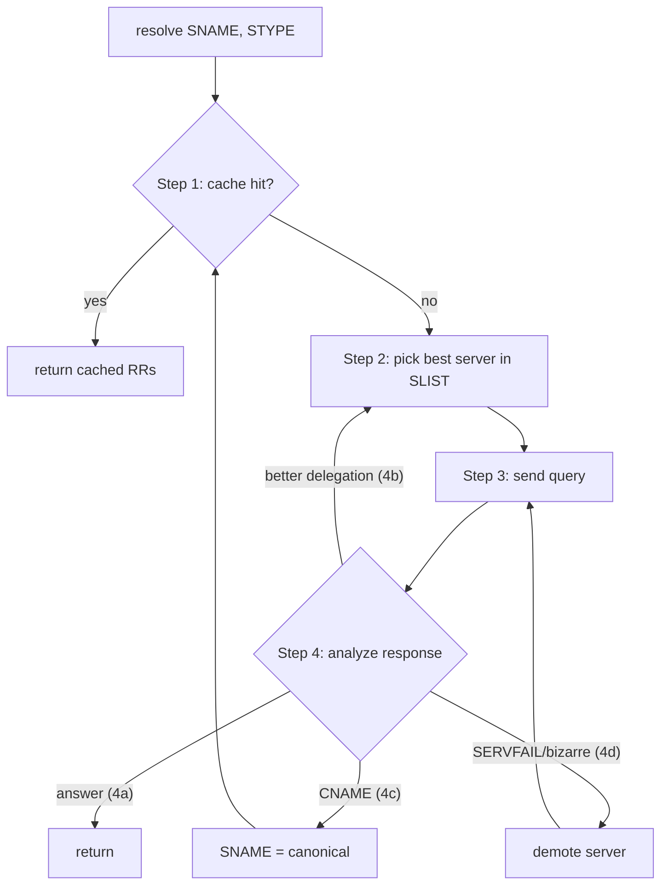
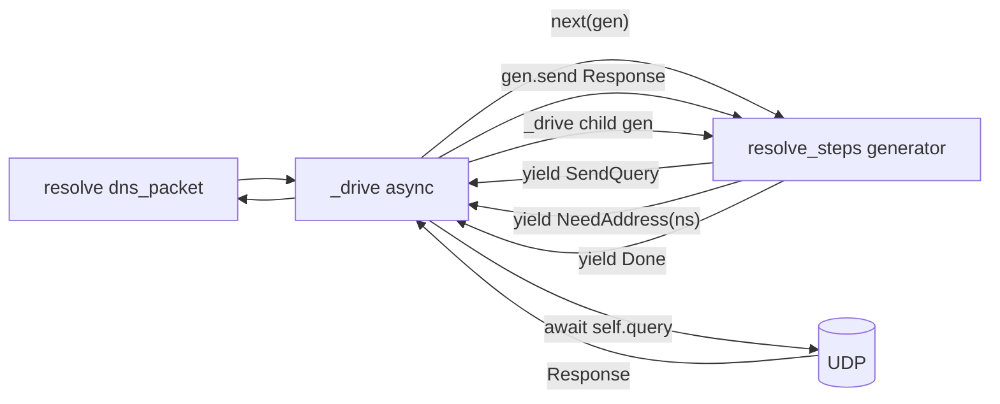

# Recursive Resolution: RFC 1034 mapped onto DNSpy

This document is the contributor reference for changes to
[`aiodns/resolver.py`](aiodns/resolver.py). It summarizes the parts of
[RFC 1034](https://www.ietf.org/rfc/rfc1034.txt) that drive resolution
decisions and points at the symbols in our code that implement each.

## 1. Recursive vs iterative service (RFC 1034 §4.3.1)

DNS messages carry two flag bits relevant to recursion:

- **RD** (Recursion Desired) — set by the *client* when it wants the
  server to chase referrals on its behalf.
- **RA** (Recursion Available) — set by the *server* when it is willing
  to provide that service.

`RecursiveResolver` accepts client queries with `RD=1` and answers
them by performing iterative resolution **upstream**: it sends its own
queries with `RD=0` to authoritative servers and follows referrals
itself. The `SendQuery` effect builds queries via
`Resolver.query(..., RD=False)`.

## 2. Resolver state (RFC 1034 §5.3.2)

| Spec field | Meaning | DNSpy symbol |
|---|---|---|
| SNAME  | The name we're searching for | `Sname.qname` |
| STYPE  | QTYPE of the search | `Sname.qtype` |
| SCLASS | QCLASS | `Sname.qclass` |
| SLIST  | Best-known nameservers for the current zone-cut | `Slist` |
| SBELT  | Safety-belt servers from configuration | `Sbelt` (built from `named.root` in `RecursiveResolver.bootstrap`) |
| CACHE  | RRs from previous responses | *not yet implemented* — TODO |

Each `SlistEntry` is a `(zone, ns, addresses, history)` row representing
one nameserver candidate.

## 3. The four-step algorithm (§5.3.3)

In DNSpy:

- **Step 1** (cache lookup): currently a no-op. The `# TODO` is inside
  `resolve_steps` at the start of each loop. A cache layer is the next
  planned addition.
- **Step 2** (pick best server): `Slist.best()` returns the first
  non-demoted entry. If that entry has no addresses, the generator
  yields `NeedAddress(ns)` and the driver runs a *nested* `resolve_steps`
  to discover them (see §7).
- **Step 3** (send): the generator yields `SendQuery(entry, questions)`;
  the async driver fulfills it with `Resolver.query(...)` and feeds the
  response back via `gen.send(response)`.
- **Step 4** (analyze): `classify(response, sname, slist, entry)` is a
  small pure generator that yields one of:
  - `Answer(records)` + `Done(response)` — final answer (4a),
  - `Referral(old_zone, new_zone, match_before, match_after)` — valid
    "closer" delegation (4b), after extending `Slist`,
  - `Cname(target)` — CNAME chase placeholder (4c, see TODO),
  - `Demote(entry, reason)` — SERVFAIL / bogus / not-closer (4d).

## 4. Match count and "closer" delegations (§5.3.3 step 4b)

A referral is only progress if the new zone has *strictly more* labels
in common with SNAME (counted from the root) than the previous zone:

- SNAME = `example.org`, current zone = `.` (match 0).
- Referral to `org.` (match 1) — accepted.
- Referral to `example.org.` (match 2) — accepted.
- Referral back to `.` or to `com.` (match 0) — rejected, server demoted.

`Sname.match_count(zone)` does the counting; `classify()` enforces the
inequality before extending `Slist`.

## 5. Negative responses (§4.3.4)

NXDOMAIN and NODATA both carry the SOA in the **authority** section of
the wire response, *not* the answer section. Our classifier mirrors
that:

- `RCODE == name_error` → NXDOMAIN. Yields `Nxdomain()` then `Done(response)`.
- `RCODE == no_error` and `AA=1` and `ANCOUNT == 0` → NODATA. The SOA
  (if present) is read straight out of `response.nameservers`; yields
  `Nodata(soa)` then `Done(response)`.

Do **not** synthesize an extra SOA query — the SOA is already in the
response we just received, and a second query would race against it.

## 6. CNAME chasing (§5.3.3 step 4c)

When an authoritative answer contains a CNAME and STYPE != CNAME, the
canonical name should become the new SNAME and the algorithm restarts
at step 1. We currently *detect* this by yielding `Cname(target)` for
trace purposes but do not yet rename SNAME and recurse — flagged TODO.

## 7. Glueless delegation (§5.3.3 step 2 priorities)

A referral can list NS names without addresses (no glue in the
additional section). We then need the address before we can query the
delegated zone. The generator yields `NeedAddress(ns_name)`; the driver
runs a nested `resolve_steps` for `ns_name A` (capped at `MAX_DEPTH`)
and feeds the resulting addresses back via `gen.send(addresses)`. The
nested resolution gets its own `Trace` child and renders as a separate
Mermaid `sequenceDiagram` block under the parent.

## 8. Server-side reply shape (§4.3.2 a/b/c)

Knowing what an authoritative server emits helps interpret what we
receive on the client side:

- **a**: matched node — copy matching RRs into answer; CNAME causes
  rename. `AA=1`.
- **b**: encountered an NS cut — copy NS RRs into authority, addresses
  into additional ("glue if needed"). `AA=0` (referral).
- **c**: no match — return NXDOMAIN (authoritative name error).

Mapping to our classifier:

| Server emits | Classifier branch |
|---|---|
| `AA=1`, `ANCOUNT > 0` | answer (4a, a) |
| `AA=0`, `ANCOUNT = 0`, `NSCOUNT > 0` | referral (4b, b) |
| `RCODE = name_error` | NXDOMAIN (4d, c) |
| `AA=1`, `ANCOUNT = 0` | NODATA (§4.3.4) |
| `RCODE = server_failure` etc. | demote (4d) |

## 9. Architecture: generator of effects

The resolver becomes pure logic that yields effect objects describing
what to do next; the async driver fulfills them. The yield stream **is**
the trace (plus nested child streams for sub-resolves). Tests drive the
generator synchronously with `gen.send(canned_response)` — no sockets.

## 10. Code mapping

| Concept | File / symbol |
|---|---|
| SBELT root hints | `RecursiveResolver.bootstrap()` -> `RecursiveResolver.sbelt` |
| SLIST construction | `Sbelt.copy_for(sname)` |
| Server selection (§5.3.3 step 2) | `Slist.best()` |
| Send (§5.3.3 step 3) | `SendQuery` effect, `Resolver.query()` |
| Analyze (§5.3.3 step 4) | `classify(response, sname, slist, entry)` |
| Match count (§5.3.3 step 4b) | `Sname.match_count(zone)` |
| Glueless NS resolution | `NeedAddress` effect + `_drive` recursion |
| Negative responses (§4.3.4) | `Nodata`, `Nxdomain` events |
| Trace tree | [`aiodns/trace.py`](aiodns/trace.py) `Trace` |
| Mermaid output | `Trace.to_mermaid()` |

## 11. TODOs explicitly tracked here

- Cache (§5.3.3 step 1) — `Slist.best()` should consult cache before
  the network. Step 4 should populate cache from authoritative answers
  and from referrals.
- CNAME chasing (§5.3.3 step 4c) — rename SNAME and restart, capped.
- AAAA glue and IPv6 sending (`Resolver.query` currently cancels on
  non-IPv4 destinations).
- Match count is computed against the zone in a referral's authority
  section. Should also reject referrals that include NS names that are
  out of bailiwick relative to the new zone (lame delegation guard).
